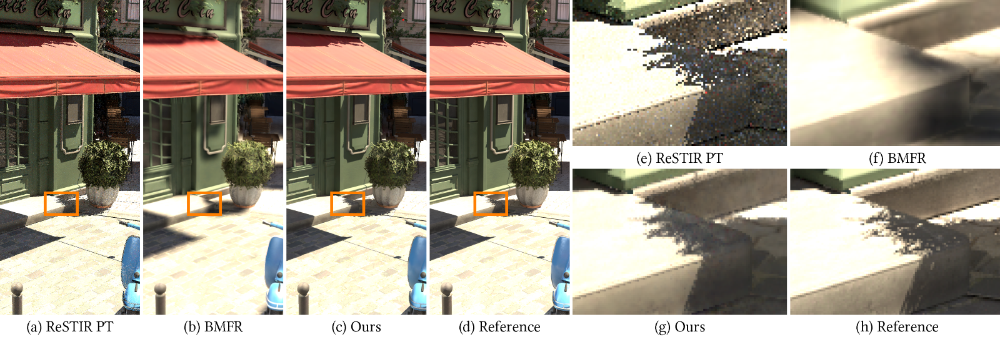

# Online Neural Denoising with Cross-Regression for Interactive Rendering

### [📄 Paper](https://drive.google.com/file/d/1D62h2clLWmqmHTbBCqihfkYDdELf7XhY/view?usp=sharing) | [📄 Paper (low-res)](siga24_cross_denoiser_preprint_lowres.pdf?raw=1) | [📁 Dataset](#-dataset)



**Authors:**  
[Hajin Choi](https://hajinchoi.me), Seokpyo Hong, Inwoo Ha, Nahyup Kang, [Bochang Moon](https://cglab.gist.ac.kr/people/bochang.html)

<!-- ## Citation
```bibtex
``` -->

---

This is the official implementation for the paper titled **"Online Neural Denoising with Cross-Regression for Interactive Rendering"** in *ACM Transactions on Graphics (Proceedings of the SIGGRAPH Asia 2024)*.

## ⚙️ Prerequisites

### 🖥️ Tested Environments
- **OS:** `Ubuntu 22.04` or `Windows 10`
    > **For Windows users**: Do not run the Docker command on Ubuntu under Windows Subsystem for Linux (WSL), as the default instance does not support GPU acceleration. We recommend installing `Docker Desktop` and using the native Windows Command Prompt or PowerShell. To enable the GPU on WSL2, refer to this [link](https://learn.microsoft.com/en-us/windows/ai/directml/gpu-cuda-in-wsl).
- **GPU:**  
  - `RTX 2080 Ti`
  - `RTX 3090`
  - `RTX 4090`
  - Others with CUDA support may work, but we have not tested them.
  - We recommend installing the latest NVIDIA driver on the host OS.
- Docker
- (For Ubuntu) [NVIDIA Docker](https://docs.nvidia.com/datacenter/cloud-native/container-toolkit/latest/install-guide.html)

## 🚀 Steps to Run the Code

1. **Clone this repository**  
    ```
    git clone https://github.com/CGLab-GIST/cross-denoiser.git
    ```
1. **Download the dataset** (see [Dataset](#-dataset)) and extract it to a directory.
1. **Modify the `docker-compose.yml` file** to mount the dataset directory to the container.  
   Update the `DATASET_DIR` variable in the `volumes` section. For example, if the downloaded dataset is located at `/home/user/dataset`:
    ```yaml
    volumes:
      - /home/user/dataset:/dataset
    ```

1. **Navigate to the repository** and run the following command to build the docker image and create a container:
    ```
    docker compose up --build -d
    ```
    *(Optionally)* In Ubuntu, give the current user/group permission to the container to access and modify the files in the mounted current directory:
    ```
    USER_UID=$(id -u) USER_GID=$(id -g) USER_NAME=$(whoami) docker compose up -d --build
    ```

1. **Attach to the container**
    ```
    docker exec -it cross-denoiser bash
    ```
1. **In the container, navigate to `~/cross-denoiser` and run `./build_customop.sh`**  
   - It will build the custom CUDA C++ operations and generate `.cu.o` and `.so` file inside the `ops` directory.
1. **Run the following command to denoise:**
    ```
    python scripts/main.py --scene Bistro --frames 101 --out_dir ./results
    ```
    The script accepts the following arguments:
    - `--scene`: The scene name (and the directory name) to denoise.
    - `--frames`: The number of frames to denoise.
    - `--out_dir`: The directory to save the denoised frames.
    - Other arguments can be found in [scripts/main.py](scripts/main.py).
    > ⚠️ **WARNING:** Ensure you have sufficient disk space, as it generates `.npy` files in the temporary directory `./tmp_scenes` for faster loading. These files consume more disk space than the original `.exr` files because they are not compressed. If you don't have enough disk space, you can disable this feature by adding `--no_npy` to the command.
1. **Check the results in the `./results` (default) directory.**

## 📁 Dataset
We provide the evaluation dataset used in the paper. Full dataset `dataset.zip` includes 101 frames of five scenes (`Bistro`, `BistroDynamic`, `EmeraldSquare`, `Staircase`, and `Musicroom`). If you want to run a quick test, you can download a smaller dataset `dataset_small.zip`, which includes first 3 frames of the `Bistro` scene.

- [dataset.zip](https://drive.google.com/file/d/1zJZ35ua5BdadNDQR4INxR1_R496sEnpD/view?usp=sharing) (Google Drive, 61 GB)
- [dataset_small.zip](https://drive.google.com/file/d/1BtSX-NGO4OR2SDos0pxMLdw_AH_fibcr/view?usp=sharing) (Google Drive, 413 MB)

### Dataset Structure
```
dataset
├── Bistro
│   ├── color_0000.exr
│   ├── color2_0000.exr
│   ├── emissive_0000.exr
│   ├── envLight_0000.exr
│   ├── albedo_0000.exr
│   ├── normal_0000.exr
│   ├── linearZ_0000.exr
│   ├── mvec_0000.exr
│   ├── pnFwidth_0000.exr
│   ├── opacity_0000.exr
│   ├── ref_0000.exr
│   ├── ref_emissive_0000.exr
│   ├── ref_envLight_0000.exr
│   ├── ...
├── BistroDynamic
├── ...
```

The images are rendered using [ReSTIR PT](https://github.com/DQLin/ReSTIR_PT) (based on Falcor 5.0), with slight modifications like splitting emissive/envLight from color.

## Acknowledgements

We thank the anonymous reviewers for their valuable feedback during the review process. We also thank the authors of [ReSTIR PT](https://github.com/DQLin/ReSTIR_PT) for providing their renderer. We took [scripts/exr.py](scripts/exr.py) from the [KPCN](https://jannovak.info/publications/KPCN/index.html). The following 3D models were used to generate images in the dataset:
- [Bistro, BistroDynamic](https://developer.nvidia.com/orca/amazon-lumberyard-bistro)
- [EmeraldSquare](https://developer.nvidia.com/orca/nvidia-emerald-square)
- [Staircase](https://www.blendswap.com/blend/14449) 

[Hajin Choi](https://hajinchoi.me) created the `Musicroom` scene using the following assets:
- Modern living room: https://blendswap.com/blend/8683
- Tank Drum: https://sketchfab.com/3d-models/tank-drum-c23a50717e6e48a48a28fe571409c09c
- Baby Grand Piano: https://blendswap.com/blend/29080
- Carlisle Desk Lamp: https://blendswap.com/blend/28803
- Fender Stratocaster: https://blendswap.com/blend/3272
- Design Table Round with DECO: https://blendswap.com/blend/26159
- Low Poly Deer on Wall Scene: https://blendswap.com/blend/26863
- Realistic Violin: https://blendswap.com/blend/23811
- Nature Bushes By Lake: https://hdri-haven.com/hdri/nature-bushes-by-lake


## License
All source codes are released under a BSD License.
