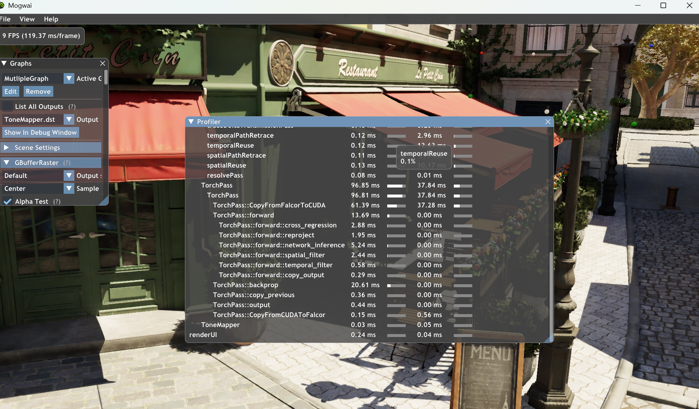

# Online Neural Denoising with Cross-Regression for Interactive Rendering (interactive demo)


This branch (`falcor`) contains an interactive demo for the SIGGRAPH 2024 paper, **Online Neural Denoising with Cross-Regression for Interactive Rendering**. It is based on [ReSTIR PT](https://github.com/DQLin/ReSTIR_PT), which was built on top of [Falcor](https://github.com/NVIDIAGameWorks/Falcor). If you use this project or find it useful for your research, please cite the paper.

## Citation
```bibtex
@article{choi24cross,
  author     = {Choi, Hajin and Hong, Seokpyo and Ha, Inwoo and Kang, Nahyup and Moon, Bochang},
  title      = {Online Neural Denoising with Cross-Regression for Interactive Rendering},
  year       = {2024},
  issue_date = {December 2024},
  publisher  = {Association for Computing Machinery},
  address    = {New York, NY, USA},
  volume     = {43},
  number     = {6},
  issn       = {0730-0301},
  url        = {https://doi.org/10.1145/3687938},
  doi        = {10.1145/3687938},
  journal    = {ACM Trans. Graph.},
  month      = nov,
  articleno  = {221},
  numpages   = {12}
}
```

## Tested Environment
- Windows 11
- Visual Studio 2022 (with support for Visual Studio 2019 compiler)
- CUDA 11.8
- LibTorch 2.5.1+cu118
- NVAPI 530
- NVIDIA Driver 560.94
- RTX Graphics Card (tested `RTX 4090`, `RTX 2080` and `RTX 5000 with Max-Q`)

## Steps to Run
1. Install `Visual Studio 2022` with the following components (or you can use the 2019 version instead):
   - MSVC v142 - VS 2019 C++ x64/x86 build tools
   - Windows 10 SDK (10.0.19041.0)
1. Install `CUDA 11.8`
1. Copy the contents of the CUDA directory (`C:/Program Files/NVIDIA GPU Computing Toolkit/CUDA/v11.8`) into `(ProjectDIR)/Source/Externals/.packman/` and rename it to `cuda`
   - It should be located like this: `.packman/cuda/bin`
1. Download `NVAPI`, `LibTorch`
   - You should disable the `OptixDenoiser` project from the solution if you don't need it.
1. Copy the directories into `(ProjectDIR)/Source/Externals/.packman/`
   - They should be located under the `.packman` directory as follows:
       - NVAPI: `.packman/nvapi/nvapi.h`, ...
       - LibTorch: `.packman/libtorch/lib`, ...
1. Open `Falcor.sln`, set the configuration to `ReleaseD3D12`, and then try to build the solution. 
   - During the initial build, `packman` will download the necessary files required to run the project, which may take some time.
1. Copy the following binaries to `Bin/x64/Release/`
   - Copy `python37.dll` from `Source/Externals/.packman/python/`
   - Copy all files from `Source/Externals/.packman/libtorch/`
1. Launch the interactive demo using the following command. Ensure the scene path is set beforehand in the script (see the [Usage](#usage) section below):
   ```
   .\Bin\x64\Release\Mogwai.exe --script=main.py
   ```

If you encounter any problems during compilation or execution, please open an issue.

## Usage
The `main.py` script contains all configurations such as setting up the render graph and loading the scene. 
For example, you should set your own scene path for the `FILE` variable in the script. Here is the list of variables to be changed for tests:
| Variable    | Description                                                                                       |
|-------------|---------------------------------------------------------------------------------------------------|
| `FILE`      | Scene path (e.g., pyscene or fbx)                                                                 |
| `INTERACTIVE` | Flag to toggle between interactive mode and image writing mode (set to `False` to save images to the directory specified by `OUT_DIR`) |
| `OUT_DIR` | Directory where images will be saved |
| `NAME`        | Name of the scene for exposure control |
| `ANIM`        | Specify the frames to render |

## Test Scenes
The scenes tested in the paper can be accessed through the following links:
- *Bistro*: [Amazon Lumberyard Bistro](https://developer.nvidia.com/orca/amazon-lumberyard-bistro)
- *Emerald Square*: [NVIDIA Emerald Square City Scene](https://developer.nvidia.com/orca/nvidia-emerald-square)

## Known Limitations
The rendered results from this interactive demo may differ from those presented in the paper due to the following reasons:
1. This demo doesn't utilize multi-sampled G-buffers (e.g., albedo and normal)
1. The inputs are rendered using a different random seed used in the paper
1. A different neural network framework is used (Tensorflow in the paper vs. LibTorch in this demo)